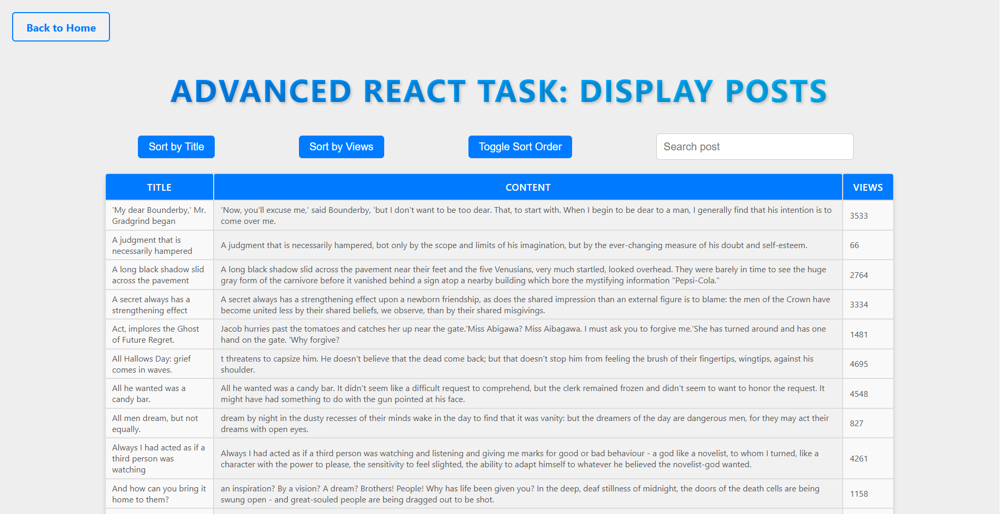

# React Frontend Tasks with TanStack

This project is a collection of frontend tasks built using **React** and **@tanstack/react-query**. It includes features such as **fetching**, **sorting**, **searching**, a **loading spinner**, and optimized data handling using `placeholderData` for a seamless user experience.

## Features

- **Fetching Data**: Uses `@tanstack/react-query` to fetch data efficiently.
- **Sorting**: Implements sorting functionality for titles and views.
- **Searching**: Allows users to filter and search for specific posts.
- **Loading Spinner**: Displays a loading indicator while fetching data.
- **Optimized Pagination**: Utilizes `placeholderData: keepPreviousData` to maintain previous page data while the new one loads, providing a smooth user experience.

## Installation

1. Clone the repository:
   ```sh
   git clone https://github.com/your-username/react-frontend-tasks.git
   ```
2. Navigate to the project directory:
   ```sh
   cd react-frontend-tasks
   ```
3. Install dependencies:
   ```sh
   npm install
   ```

## Usage

1. Start the development server:
   ```sh
   npm run dev
   ```
2. Open `http://localhost:3000` in your browser.

## To start the server

1. Go to vite.config.ts and comment:
   ```sh
    base: process.env.VITE_BASE_PATH || "/React_TanStack"
   ```
2. Then do:
   ```sh
   npm run dev
   ```

## Technologies Used

- React
- TypeScript
- @tanstack/react-query
- Styled-components

## Folder Structure

```
📦 react-frontend-tasks
 ┣ 📂 src
 ┃ ┣ 📂 components
 ┃ ┣ 📂 service
 ┃ ┣ 📂 static
 ┃ ┣ 📂 utils
 ┃ ┗ 📜 main.tsx
 ┣ 📜 README.md
 ┣ 📜 tsconfig.json
 ┗ 📜 package.json
```

## Contributing

Contributions are welcome! Feel free to fork the repository and submit a pull request.

## License

This project is licensed under the MIT License.


## Screenshot



